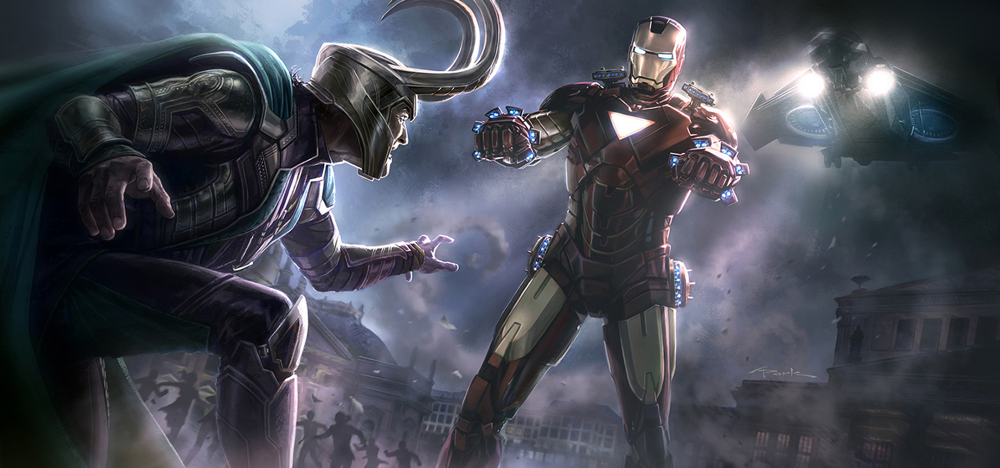

<!-- [](https://travis-ci.org/mpaland/printf) -->

<a href="https://github.com/catellaTech/ERC20-FOUNDRY-TEST/actions/workflows/test.yml"></a>


<a href="https://github.com/catellaTech" target="_blank">
    
  </a>
<br>
<br>

<h1>Testing an ERC20 token with Foundry</h1>

For this test, we wanted to have some fun and set up two scenarios:
(Tony), the owner of the project, and (Loki), a bad player 😈 behind the scenes. Tony, trusting Loki, approved half of the project's supply to grow it together. Loki decides to search and audit the smart contract, discovers the transferFrom function, and can imagine his face when he thought Tony was not as smart as he thought. He decides to send himself all the funds. But he did not count on Tony having a backup plan and calling the burnTokens() function, which can only be executed by the owner of the project, leaving Loki with nothing 😎, he decided to create more tokens and learned not to trust anyone. End.

The story serves to underscore the importance of being careful with whom control and responsibility of the project are shared. 📚🔓

What you will practices in this test:
- setUp: it's an optional function, it's like the beforeEach in JS
- The functions we want to test must start with "test", they're like the "it" in JS
- We practiced the "revert" in functions and the correct order for it to work:
```solidity
    // We expect revert with another user
        vm.startPrank(loki);
        vm.expectRevert("You're not the owner");
        myToken.crearTokens();
        vm.stopPrank();
```
and so much more.

The main idea of this project was to practice Foundry and its most basic commands for testing with Solidity. 
🚨Note: One of the commands that helped us detect errors faster with -v (verbosity).

Verbosity of the EVM.

Pass multiple times to increase the verbosity (e.g. -v, -vv, -vvv).

Verbosity levels:

2: Print logs for all tests
3: Print execution traces for failing tests
4: Print execution traces for all tests, and setup traces for failing tests
5: Print execution and setup traces for all tests.

<hr>
<h2> Installing / Getting started </h2>

```bash
# Clone this project
$ git clone https://github.com/catellaTech/ERC20-FOUNDRY-TEST

# Access
$ cd ERC20-FOUNDRY-TEST

# Install dependencies
$ forge install
``` 

<h2>Commands</h2>

- $ `forge build`
- $ `forge test -vvvv`


<h2> Technologies / Built With </h2>

- Solidity
- Foundry

<h2>Contributing</h2>
Contributions are always welcome! Open a PR or an issue!

<br>
<br>

<p align="center">
<a href="mailto:catellatech@gmail.com" target="_blank" >
  
</a> 
<br/>
  Made with ❤️ by <b>catellaTech</b>.
<p/>
